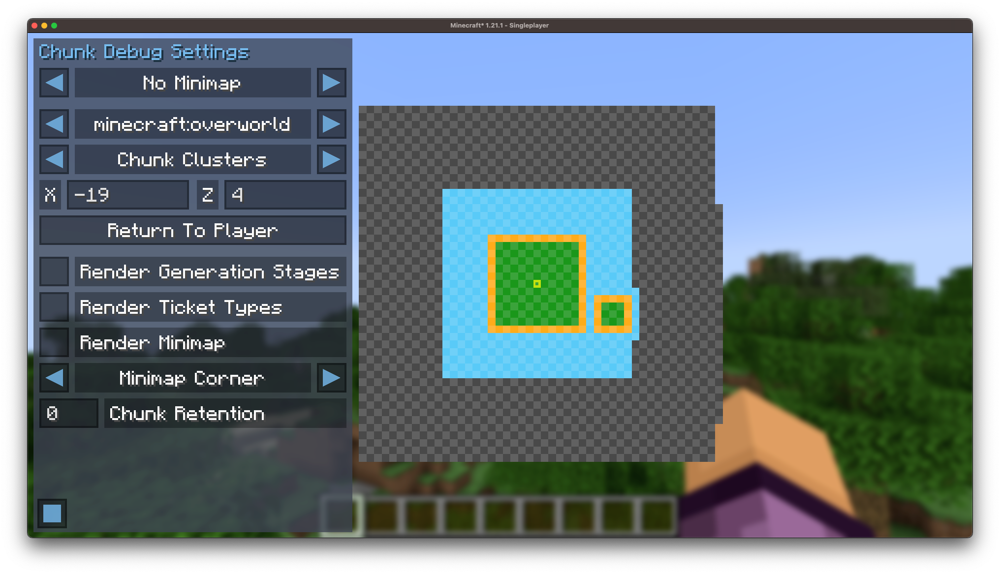

#  ChunkDebug

## What is ChunkDebug?

ChunkDebug is an extremely useful tool for debugging chunk loading. 
It provides you with a live display of all the loaded chunks in any given dimension.
It is able to display the chunk's current status, any chunk tickets, as well as 
the chunk world generation stage.

ChunkDebug was originally made for [CarpetClient 1.12.2](https://github.com/X-com/CarpetClient).
I have completely re-written the mod to support modern versions of Minecraft.
I only plan on maintaining the mod for the **latest** version of Minecraft.

## How to use ChunkDebug

ChunkDebug is required on both the client and the server. 
If you are playing in single player, then you only need to install this mod on the client.

You can download the mod from Modrinth:

[![Modrinth download](https://img.shields.io/modrinth/dt/chunk-debug?label=Download%20on%20Modrinth&style=for-the-badge&logo=data:image/svg+xml;base64,PHN2ZyB4bWxucz0iaHR0cDovL3d3dy53My5vcmcvMjAwMC9zdmciIHhtbDpzcGFjZT0icHJlc2VydmUiIGZpbGwtcnVsZT0iZXZlbm9kZCIgc3Ryb2tlLWxpbmVqb2luPSJyb3VuZCIgc3Ryb2tlLW1pdGVybGltaXQ9IjEuNSIgY2xpcC1ydWxlPSJldmVub2RkIiB2aWV3Qm94PSIwIDAgMTAwIDEwMCI+PHBhdGggZmlsbD0ibm9uZSIgZD0iTTAgMGgxMDB2MTAwSDB6Ii8+PGNsaXBQYXRoIGlkPSJhIj48cGF0aCBkPSJNMTAwIDBIMHYxMDBoMTAwVjBaTTQ2LjAwMiA0OS4yOTVsLjA3NiAxLjc1NyA4LjgzIDMyLjk2MyA3Ljg0My0yLjEwMi04LjU5Ni0zMi4wOTQgNS44MDQtMzIuOTMyLTcuOTk3LTEuNDEtNS45NiAzMy44MThaIi8+PC9jbGlwUGF0aD48ZyBjbGlwLXBhdGg9InVybCgjYSkiPjxwYXRoIGZpbGw9IiMwMGQ4NDUiIGQ9Ik01MCAxN2MxOC4yMDcgMCAzMi45ODggMTQuNzg3IDMyLjk4OCAzM1M2OC4yMDcgODMgNTAgODMgMTcuMDEyIDY4LjIxMyAxNy4wMTIgNTAgMzEuNzkzIDE3IDUwIDE3Wm0wIDljMTMuMjQgMCAyMy45ODggMTAuNzU1IDIzLjk4OCAyNFM2My4yNCA3NCA1MCA3NCAyNi4wMTIgNjMuMjQ1IDI2LjAxMiA1MCAzNi43NiAyNiA1MCAyNloiLz48L2c+PGNsaXBQYXRoIGlkPSJiIj48cGF0aCBkPSJNMCAwdjQ2aDUwbDEuMzY4LjI0MUw5OSA2My41NzhsLTIuNzM2IDcuNTE3TDQ5LjI5NSA1NEgwdjQ2aDEwMFYwSDBaIi8+PC9jbGlwUGF0aD48ZyBjbGlwLXBhdGg9InVybCgjYikiPjxwYXRoIGZpbGw9IiMwMGQ4NDUiIGQ9Ik01MCAwYzI3LjU5NiAwIDUwIDIyLjQwNCA1MCA1MHMtMjIuNDA0IDUwLTUwIDUwUzAgNzcuNTk2IDAgNTAgMjIuNDA0IDAgNTAgMFptMCA5YzIyLjYyOSAwIDQxIDE4LjM3MSA0MSA0MVM3Mi42MjkgOTEgNTAgOTEgOSA3Mi42MjkgOSA1MCAyNy4zNzEgOSA1MCA5WiIvPjwvZz48Y2xpcFBhdGggaWQ9ImMiPjxwYXRoIGQ9Ik01MCAwYzI3LjU5NiAwIDUwIDIyLjQwNCA1MCA1MHMtMjIuNDA0IDUwLTUwIDUwUzAgNzcuNTk2IDAgNTAgMjIuNDA0IDAgNTAgMFptMCAzOS41NDljNS43NjggMCAxMC40NTEgNC42ODMgMTAuNDUxIDEwLjQ1MSAwIDUuNzY4LTQuNjgzIDEwLjQ1MS0xMC40NTEgMTAuNDUxLTUuNzY4IDAtMTAuNDUxLTQuNjgzLTEwLjQ1MS0xMC40NTEgMC01Ljc2OCA0LjY4My0xMC40NTEgMTAuNDUxLTEwLjQ1MVoiLz48L2NsaXBQYXRoPjxnIGNsaXAtcGF0aD0idXJsKCNjKSI+PHBhdGggZmlsbD0ibm9uZSIgc3Ryb2tlPSIjMDBkODQ1IiBzdHJva2Utd2lkdGg9IjkiIGQ9Ik01MCA1MCA1LjE3MSA3NS44ODIiLz48L2c+PGNsaXBQYXRoIGlkPSJkIj48cGF0aCBkPSJNNTAgMGMyNy41OTYgMCA1MCAyMi40MDQgNTAgNTBzLTIyLjQwNCA1MC01MCA1MFMwIDc3LjU5NiAwIDUwIDIyLjQwNCAwIDUwIDBabTAgMjUuMzZjMTMuNTk5IDAgMjQuNjQgMTEuMDQxIDI0LjY0IDI0LjY0UzYzLjU5OSA3NC42NCA1MCA3NC42NCAyNS4zNiA2My41OTkgMjUuMzYgNTAgMzYuNDAxIDI1LjM2IDUwIDI1LjM2WiIvPjwvY2xpcFBhdGg+PGcgY2xpcC1wYXRoPSJ1cmwoI2QpIj48cGF0aCBmaWxsPSJub25lIiBzdHJva2U9IiMwMGQ4NDUiIHN0cm9rZS13aWR0aD0iOSIgZD0ibTUwIDUwIDUwLTEzLjM5NyIvPjwvZz48cGF0aCBmaWxsPSIjMDBkODQ1IiBkPSJNMzcuMjQzIDUyLjc0NiAzNSA0NWw4LTkgMTEtMyA0IDQtNiA2LTQgMS0zIDQgMS4xMiA0LjI0IDMuMTEyIDMuMDkgNC45NjQtLjU5OCAyLjg2Ni0yLjk2NCA4LjE5Ni0yLjE5NiAxLjQ2NCA1LjQ2NC04LjA5OCA4LjAyNkw0Ni44MyA2NS40OWwtNS41ODctNS44MTUtNC02LjkyOVoiLz48L3N2Zz4=)](https://modrinth.com/mod/chunk-debug)

If you are playing on a server, then you will need the correct permissions to use ChunkDebug.
You must be opped, or alternatively you must have the `"chunk-debug"` permission from a 
permissions mod, for example [Luck Perms](https://modrinth.com/mod/luckperms).

Once you are in-game, you can hit the ChunkDebug keybind (`F6` by default) which will
open the ChunkDebug map. 
You can change this key in the Minecraft controls menu.

### Chunk Map

In the centre is the ChunkDebug map, this is where the live chunk
map is displayed, you can pan and zoom around the map.

### Settings Menu

The menu on the left contains all the options for ChunkDebug.
This can be hidden by pressing `F1` or by toggling the button
in the bottom left corner.

At the top, you can change your minimap mode. 
This can be configured to `No Minimap`, `Static Minimap`, where the 
minimap will reflect what is currently rendering at the centre of the
chunk map, and `Following Minimap`, where the minimap will follow your player. 

Below this are your navigation controls, you can navigate to different
dimensions. 
As well as chunk clusters, this will cycle through any loaded groups 
of chunks that are neighbouring each other. 
This is a great tool for finding loaded chunks in your world.
You can also manually input your coordinates or return to the player's position.

Finally, there are some additional rendering options. 
`Render Generation Stages` will colour chunks based on their world
generation stage, this can get quite messy so an option to disable it is provided.
`Render Ticket Types` will colour chunks based on their ticket types.
`Render Minimap` will render the minimap *on top* of the chunk map, this is useful for lining up your minimap view. 
And finally `Chunk Retention` is the number of ticks you'd like to
retain unloaded chunks, after a chunk unloads it will fade out for the
number of ticks specified. 
This is useful for debugging chunks that unload rapidly.

You can configure the position of the minimap; you first select the corner you want
the minimap to render relative to by changing the `Minimap Corner` configuration,
if you want to further fine-tune the position of the minimap you can enable `Render Minimap`
which will allow you to click and drag the minimap around. 
You can also scroll while hovering the minimap to resize it. 

### Selection Menu

You can select chunks on the chunk map by right-clicking, this will
highlight the chunk with a red outline, it will also bring up a menu
on the right displaying all the relevant information for that chunk.
This menu can be closed much like the settings menu with `F1` or the button in the bottom right.

The menu displays the location of the chunks, as well as the chunk 
status; 
you can read more about what this means on the [Minecraft Wiki Page](https://minecraft.wiki/w/Chunk#Level_and_load_type).
The separation of the `Status Level` and `Ticking Status Level` is due to the split of Simulation Distance and Render Distance.
Below, all the tickets for the selected chunk are listed, including 
the type of the ticket and the level. 
Below that is the `Generation Stage` which is how far the chunk has generated.
And finally, whether the chunk has been scheduled for unloading.

You are also able to select multiple chunks by dragging right-click,
this will highlight a region of chunks with a red outline.

The menu will now display less specific information but displays
data for all the selected chunks.
It shows the location and area of your selection. 
The status level range of the chunks, as well as the status distributions of all the chunks.
And finally a count of all the ticket types within the selection.